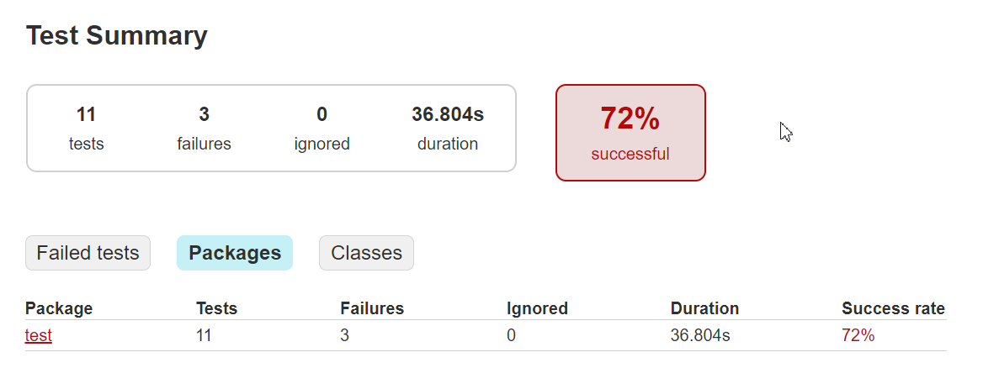
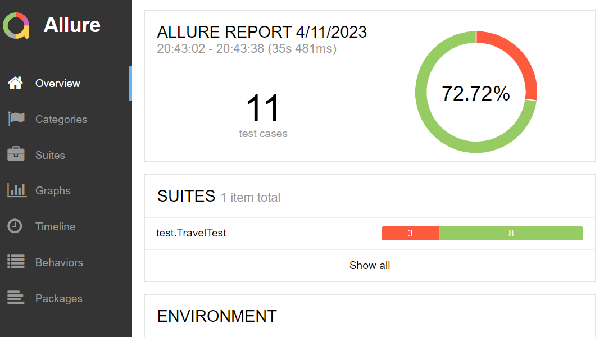

# Отчётные документы по итогам тестирования

## Краткое описание
Отчёт по результату автоматизированного тестированию функционала покупки и оформления кредита по данным карты веб-сервиса покупки тура
"Путешествие дня".

## Количество тест-кейсов
Была проведена автоматизация 12 тест-кейсов. По результату автоматизированных тестов обнаружено 7 багов. По всем багам заведены Issues.

Итого процент успешных автоматизированных показателей составил 72%.

## Общие рекомендации
1. Во всех случаях, когда поля формы остаются не заполненными, реализовать появление предупреждающей надписи "Поле обязательно для заполнения" вместо "Неверный формат".
2. Уточнить требования к полю "Владелец", в случае, если данные должны соответствовать данным на карте, реализовать возможность вводить данные только латинскими буквами
3. Возможно, была бы удобной опция сохранять данные в анкете при переключении между функциями "Купить" и "Купить в кредит". Сейчас анкета очищается каждый раз.
4. Добавление чекбокс согласия пользователя на обработку персональных данных.
